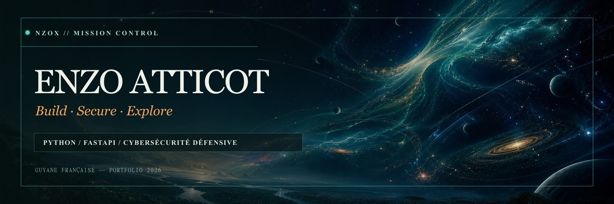
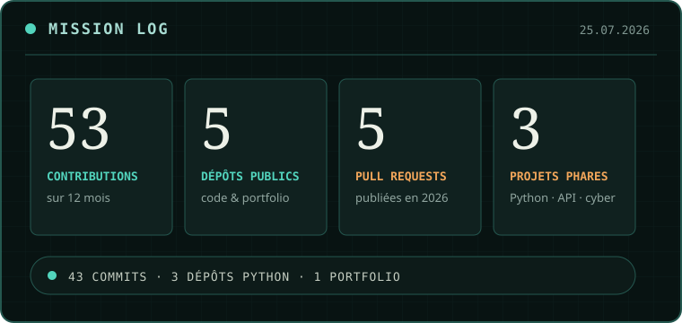
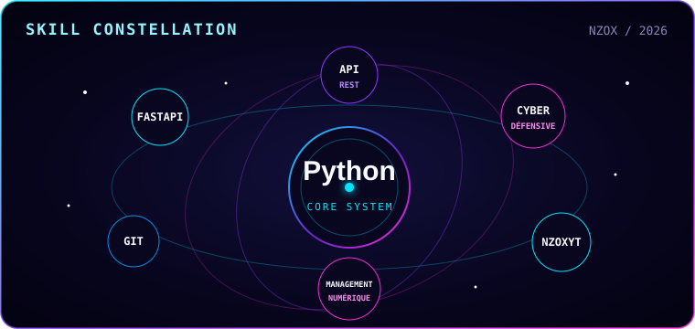
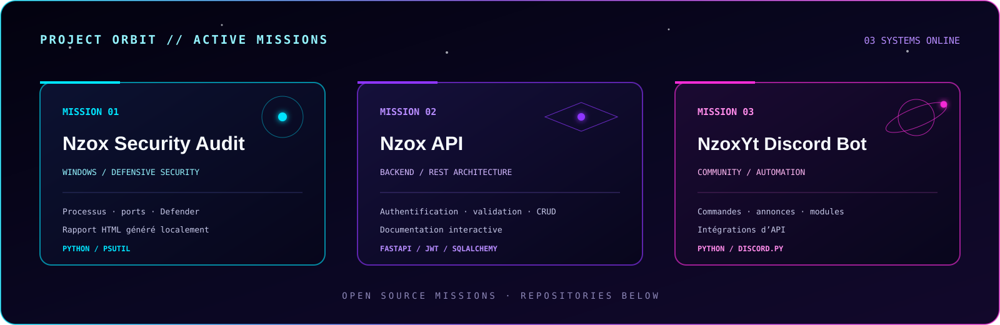
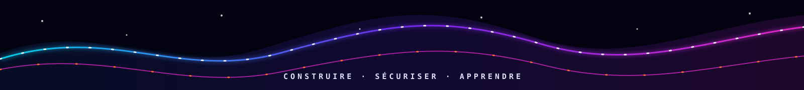

<div align="center">
  
</div>

<div align="center">
  <a href="https://nzox973.github.io/"><strong>PORTFOLIO</strong></a>
  &nbsp;·&nbsp;
  <a href="https://www.linkedin.com/in/enzo-atticot/"><strong>LINKEDIN</strong></a>
  &nbsp;·&nbsp;
  <a href="https://learn.microsoft.com/en-us/users/enzoatticot-7921/"><strong>MICROSOFT LEARN</strong></a>
</div>

<br>



## 🛰️ Mission control

<table>
  <tr>
    <td width="50%">
      
    </td>
    <td width="50%">
      
    </td>
  </tr>
</table>

> Ces repères publics sont confirmés au **13 août 2026**. La télémétrie
> située plus bas se met à jour automatiquement avec l’activité GitHub.

## Transmission

Je suis **Enzo ATTICOT**, étudiant admis en **Bachelor Management & Numérique**
au Pôle Supérieur de Guyane pour la rentrée de septembre 2026, après un
baccalauréat Mathématiques et NSI. Je construis des projets en **Python** et
**FastAPI**, avec un intérêt particulier pour les API, la qualité logicielle
et la transformation de besoins métier en outils utiles. Je consolide aussi
SQL avant de construire des cas data/BI à partir de données documentées.

Chaque dépôt documente une progression réelle : code, essais, corrections et
amélioration continue.

## 🚀 Projets en orbite



| Mission | Système construit | Technologies | Accès |
| --- | --- | --- | :---: |
| **Nzox Security Audit** | Audit défensif d’un poste Windows et génération locale d’un rapport HTML lisible | Python · `psutil` · Windows | [Ouvrir le dépôt](https://github.com/Nzox973/nzox-security-audit) |
| **Nzox API** | API REST structurée avec authentification, validation et opérations CRUD | FastAPI · SQLAlchemy · JWT · Pydantic | [Ouvrir le dépôt](https://github.com/Nzox973/nzox-api) |
| **NzoxYt Discord Bot** | Bot communautaire modulaire avec automatisations et intégrations d’API | Python · `discord.py` · API | [Ouvrir le dépôt](https://github.com/Nzox973/nzox-discord-bot) |

### Architecture de travail

```text
IDÉE  ──►  PROTOTYPE  ──►  DOCUMENTATION  ──►  TESTS  ──►  AMÉLIORATION
  │              Python · Git · GitHub · PowerShell · VS Code              │
  └──────────────────────────── progression continue ───────────────────────┘
```

## 📡 Télémétrie en direct

<div align="center">
  
  <br>
  
</div>

### Sondes des dépôts

<div align="center">
  <a href="https://github.com/Nzox973/nzox-security-audit">
    
  </a>
  <a href="https://github.com/Nzox973/nzox-api">
    
  </a>
  <a href="https://github.com/Nzox973/nzox-discord-bot">
    
  </a>
  <br>
  <a href="https://github.com/Nzox973?tab=followers">
    
  </a>
  <a href="https://github.com/Nzox973?tab=repositories">
    
  </a>
</div>

## 🧭 Journal de bord

| Maintenant | Prochaine trajectoire |
| --- | --- |
| Consolider Python, FastAPI, SQL et Git | Approfondir les tests et la qualité logicielle |
| Documenter clairement les choix et les limites | Relier management, numérique et réalisation technique |
| Développer dans un cadre défensif et légal | Contribuer à des projets utiles, en Guyane ou à distance |
| Préparer la rentrée de septembre 2026, admission acquise | Transformer chaque apprentissage en preuve concrète |

## 🔭 Points d’observation

- [Portfolio](https://nzox973.github.io/) — projets, parcours et point d’entrée principal
- [LinkedIn](https://www.linkedin.com/in/enzo-atticot/) — formation et expériences
- [Microsoft Learn](https://learn.microsoft.com/en-us/users/enzoatticot-7921/) — apprentissages suivis
- [YouTube — NzoxYt](https://www.youtube.com/@NzoxYt) — création de contenu
- [Twitch — NzoxYt](https://www.twitch.tv/nzoxyt) — diffusion en direct

<details>
  <summary><strong>Cadre de publication et confidentialité</strong></summary>
  <br>
  Les projets de sécurité présentés ici sont conçus pour l’apprentissage,
  l’administration autorisée et la défense. Les identifiants officiels,
  numéros de certification, coordonnées privées et informations sensibles ne
  sont pas publiés sur ce profil.
</details>

<br>


